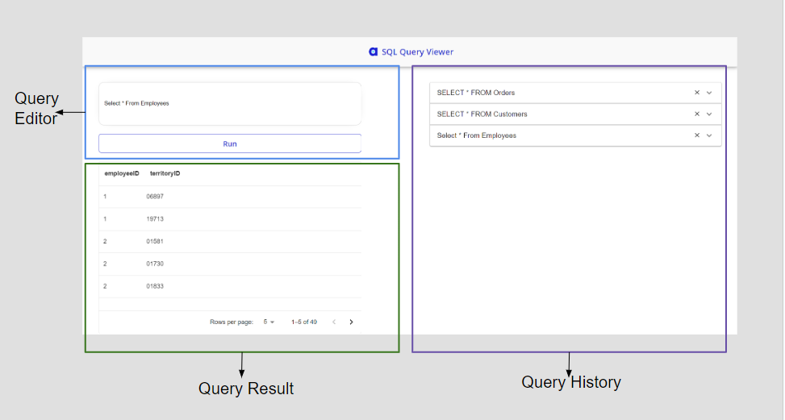

# Atlan - SQL Query Viewer

## Overview
SQL Query Viewer is a web application that enables users to effortlessly execute SQL queries and obtain relevant result tables. This project provides a refined yet user-friendly interface, blending essential functions with advanced features to ensure a smooth user experience.

## Deployed Wesite Link

### Visit the Web application [here](https://symphonious-marzipan-61af8a.netlify.app/).

## Project Structure
   
    ├── src                             
    │   ├── components                  
    |   |   ├── footer                          
    │   |   ├── header           
    │   |   ├── form           
    │   |   ├── ui           
    |   |   ├── GetStarted.jsx             # This is the landing page of web application SQL Query Viewer.   
    |   |   ├── GetStarted.module.css               
    │   |   ├── QueryDasboard.jsx          # This is the dashboard of query - the parent component to Query Handler, Query History.
    │   |   ├── QueryEditor.jsx            # This ocmponent displys the text area to enter query and validates it and has button to execute query.
    │   |   ├── QueryHandler.jsx           # The parent component to Query Editor, Query Result which make the api call to get query result.
    │   |   ├── QueryHistory.jsx           # This displays the list of queries being searched. You can even remove a query from history.  
    │   |   └── QueryResult.jsx            # This component displays the query result.  
    │   ├── App.js             
    │   ├── App.cs            
    │   ├── index.js           
    │   └── index.css                
    └── backend
    │   ├── models                         # Contains Query Result Schema
    │   ├── utils                          # It consists of Query Result Generator function which generates result corresponding to the query.
    │   └── server.js                      # It consists of express app and routes.
    └── ...

</img>
## Technologies

* Frontend framework: ReactJs
* Other major plugin/packages: Material UI
* Backend framework: NodeJs, ExpressJs
* Database: MongoDB

## Features

### Required Features

1. **Query Input Space**: Implemented
   - A space to accept SQL queries.

2. **Generate a table for a query result**: Implemented
   - Displays random data from a one of the three data files in an organized table.

3. **Predefined Queries And Result**: Implemented
   - Created more than one predefined query and result.
   - Provides a mechanism (dropdown) to toggle between these queries and view associated data.

### Great to Have Features

1. **Large Data Table Handling**: Implemented
   
   - Utilizes pagination to display large data tables without crashing the browser.

### Additional Features

1. **Past Queries Display**: Implemented 
   - Need: To provide a section where users can see a history of executed queries.
   - Description: The application includes a dedicated section displaying past queries, allowing users to toggle between them and see their result.

2. **Query History Persistence**: Implemented 
   - Need: User might end up reloading the web application.
   - Description: The application stores executed queries in local storage, ensuring they remain accessible across sessions.
  
3. **Form Validation**: Implemented 
   - Need: To make sure user provides some input otherwise show some appropriate error message.

4. **Integrated Backend**: Implemented
   - Need: To provide api driven data for query result.
   - Description: Built Express server to handle query search and respond with the result after interacting with database.
  
5. **Integrated MongoDB**: Implemented
   - Need: Better to have data from backend than hard coded dummy data.
   - Description: Integrated MongoDB using mongoose and seeded it with dummy data so backend can interact with database and respond with query result.

6. **Sortable and Hideable Columns**: Implemented 
   - Need: To allow users to sort the table based on any attribute in ascending or descending order.
   - Need: To provide the ability to hide specific table columns.
   - Status: Implemented
   - Description: Users can sort the table by clicking column headers and hide/unhide columns as needed.

7. **Mobile Responsiveness**: Implemented
   - Need: To ensure the application is designed to work seamlessly on mobile devices.
   - Description: The components are designed to be responsive depending on device type i.e mobile or desktop.

## Website Performance Metrics

* Performance was tested using WebPageTest
* Tested the performance for both mobile and desktop devices.

### Mobile Performance

* Time taken for first byte to arrive: .697s
* Time taken for all content to arrive and to render: 2.756s
* Page Weight: 277 KB

### Desktop Performance

* Time taken for first byte to arrive: .160s
* Time taken for all content to arrive and to render: .824s
* Page Weight: 277 KB

## Optimisations Done To Decrease The Load Time

* Compressed image (logo).
* Compressess CSS and JS files.
* Used useCallback() and memo() to avoid redundant component renders.

## Setup & Usage

- Make sure you have node installed in your local environment by running `node -v` in your terminal
- Install necesssary dependencies by `npm install` in the root directory and backend directory 
- Run the server by `npm start` and in backend directory `node server.js`
---

## Contact
### Linkedin Profile [here](https://www.linkedin.com/in/kajalkaushal/).
